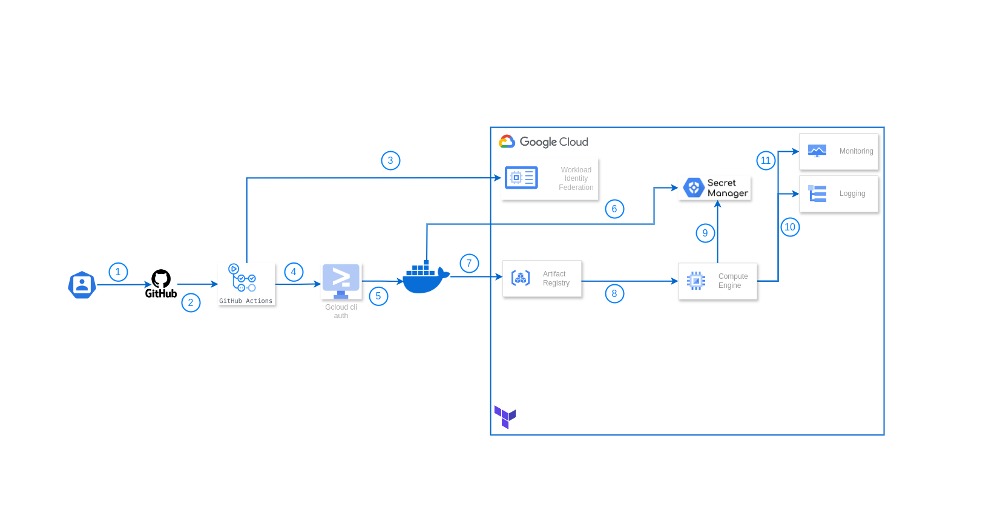
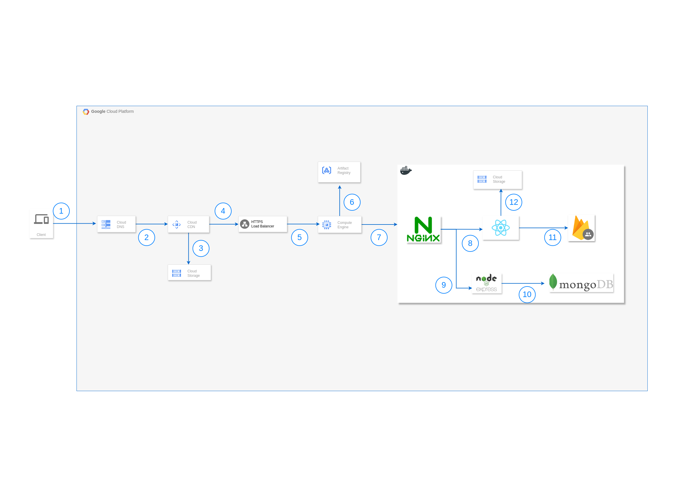

# YouTube Clone MERN Stack with GCP

This repository contains a YouTube clone built using the MERN stack (MongoDB, Express.js, React.js, Node.js) and deployed on Google Cloud Platform (GCP) using Terraform. The CI/CD pipeline was made using github actions.

# Table of Contents

- [YouTube Clone MERN Stack with GCP](#youtube-clone-mern-stack-with-gcp)
- [Table of Contents](#table-of-contents)
- [GCP Infrastructure as Code](#gcp-infrastructure-as-code)
  - [Features](#features)
  - [Prerequisites](#prerequisites)
- [Architecture Overview](#architecture-overview)
  - [CI/CD Pipeline](#cicd-pipeline)
  - [Application Architecture](#application-architecture)
- [Setup](#setup)
  - [Initial Setup](#initial-setup)
  - [Grant necessary roles for Terraform](#grant-necessary-roles-for-terraform)
      - [Example `common.tfvars` File](#example-commontfvars-file)
  - [Setup Guide for Firebase and MongoDB](#setup-guide-for-firebase-and-mongodb)
    - [1. Create a Firebase Account](#1-create-a-firebase-account)
    - [2. Configure Domain Access](#2-configure-domain-access)
    - [3. Configure `./client/src/firebase.js`](#3-configure-clientsrcfirebasejs)
    - [4. Create a MongoDB Cluster](#4-create-a-mongodb-cluster)
      - [5. Get Your MongoDB URI](#5-get-your-mongodb-uri)
    - [6. Storing Secrets in Google Cloud Secret Manager](#6-storing-secrets-in-google-cloud-secret-manager)
- [Technical Documentation](#technical-documentation)
- [License](#license)

--- 


# GCP Infrastructure as Code

[](https://www.terraform.io/)
[](https://cloud.google.com/)

Production-ready infrastructure code for deploying scalable web applications on Google Cloud Platform using Terraform.

## Features

- Global Load Balancing with SSL
- Content Delivery Network (CDN)
- Automated Health Checks
- Custom Domain Configuration
- Monitoring and Logging
- Multi-environment Support

## Prerequisites

- [Git](https://git-scm.com/downloads)
- [Make](https://www.gnu.org/software/make/) (Essential for running the provided commands)
- [Google Cloud SDK](https://cloud.google.com/sdk/docs/install)
- [Terraform](https://developer.hashicorp.com/terraform/downloads)
- A [Google Cloud Platform](https://console.cloud.google.com/) account
- A [GitHub](https://github.com/) account

# Architecture Overview

## CI/CD Pipeline

[](https://github.com/features/actions)
[](https://www.docker.com/)
[](https://docs.docker.com/compose/)
[](https://cloud.google.com/)




The CI/CD pipeline follows these steps:

1. Code is pushed to GitHub repository
2. GitHub Actions workflow is triggered
3. Workload Identity Federation authenticates with GCP
4. GCloud authentication configures Docker
5. Docker image is built
6. The Build process uses secrets from Secret Manager
7. Image is pushed to Artifact Registry
8. Deployment to Compute Engine
9. Container pulls secrets from Secret Manager
10. Application logs to Cloud Logging
11. Metrics sent to Cloud Monitoring

## Application Architecture

[](https://cloud.google.com/)
[](https://www.nginx.com/)
[](https://reactjs.org/)
[](https://firebase.google.com/)
[](https://www.mongodb.com/)
[](https://nodejs.org/)
[](https://www.docker.com/)




The application flow works as follows:

1. User requests reach Cloud DNS
2. Traffic is routed through Cloud CDN
3. Static content is served from Cloud Storage
4. Load Balancer routes requests to instances
5. Compute Engine runs containerized application
6. Container images pulled from Artifact Registry
7. NGINX serves as reverse proxy
8. React frontend served from built assets
9. Express.js handles API requests
10. Backend connects to MongoDB
11. Firebase handles authentication
12. Media content stored in Cloud Storage

# Setup

This guide will walk you through setting up and deploying a YouTube clone application on Google Cloud Platform (GCP) using Terraform and GitHub Actions for CI/CD.

## Initial Setup

1. Fork the Repository

   ```bash
   # Fork the repository at https://github.com/markbosire/youtube-clone-gcp
   # Then clone your forked repository
   git clone https://github.com/YOUR_USERNAME/youtube-clone-gcp.git
   cd youtube-clone-gcp
   ```

2. Set Up GCP Service Accounts

   a. Create a Terraform Service Account:

   ```bash
    # Replace PROJECT_ID with your GCP project ID
   gcloud iam service-accounts create terraform-sa \
   --display-name="Terraform Service Account"
   ```

## Grant necessary roles for Terraform

```bash
# Create a dedicated service account for Terraform operations
# This account will be used to manage infrastructure and deploy resources
gcloud iam service-accounts create terraform-sa \
  --display-name="Terraform Service Account"

# Grant Compute Admin role
# Allows Terraform to create, modify, and delete compute resources like VMs and disks
# Essential for managing compute infrastructure
gcloud projects add-iam-policy-binding PROJECT_ID \
  --member="serviceAccount:terraform-sa@PROJECT_ID.iam.gserviceaccount.com" \
  --role="roles/compute.admin"

# Grant Compute Network User role
# Enables Terraform to use GCP networking features
# Required for configuring network interfaces, firewall rules, and VPC settings
gcloud projects add-iam-policy-binding PROJECT_ID \
  --member="serviceAccount:terraform-sa@PROJECT_ID.iam.gserviceaccount.com" \
  --role="roles/compute.networkUser"

# Grant DNS Administrator role
# Allows Terraform to manage DNS records and zones
# Necessary if your infrastructure requires DNS configuration
gcloud projects add-iam-policy-binding PROJECT_ID \
  --member="serviceAccount:terraform-sa@PROJECT_ID.iam.gserviceaccount.com" \
  --role="roles/dns.admin"

# Grant Service Account User role
# Enables Terraform to run operations as other service accounts
# Required for deploying resources that use service accounts
gcloud projects add-iam-policy-binding PROJECT_ID \
  --member="serviceAccount:terraform-sa@PROJECT_ID.iam.gserviceaccount.com" \
  --role="roles/iam.serviceAccountUser"

# Grant Storage Object Admin role
# Allows Terraform to manage storage objects and buckets
# Required for managing Terraform state files in GCS and other storage operations
gcloud projects add-iam-policy-binding PROJECT_ID \
  --member="serviceAccount:terraform-sa@PROJECT_ID.iam.gserviceaccount.com" \
  --role="roles/storage.objectAdmin"

# Create and download the service account key
# This key file will be used by Terraform to authenticate with GCP
# IMPORTANT: Keep this key secure and never commit it to version control
gcloud iam service-accounts keys create terraform-sa-key.json \
  --iam-account=terraform-sa@PROJECT_ID.iam.gserviceaccount.com
```

b. Configure Workload Identity Federation for GitHub Actions:

```bash
# Create a Workload Identity Pool
gcloud iam workload-identity-pools create "github-pool" \
  --project="${PROJECT_ID}" \
  --location="global" \
  --display-name="GitHub Actions Pool"

# Create a Workload Identity Provider
gcloud iam workload-identity-pools providers create-oidc "github-provider" \
  --project="${PROJECT_ID}" \
  --location="global" \
  --workload-identity-pool="github-pool" \
  --display-name="GitHub Provider" \
  --attribute-mapping="google.subject=assertion.sub,attribute.actor=assertion.actor,attribute.repository=assertion.repository" \
  --issuer-uri="https://token.actions.githubusercontent.com"

# Create a Service Account for GitHub Actions
gcloud iam service-accounts create github-actions-sa \
  --display-name="GitHub Actions Service Account"

# Grant required roles for GitHub Actions
gcloud projects add-iam-policy-binding PROJECT_ID \
  --member="serviceAccount:github-actions-sa@PROJECT_ID.iam.gserviceaccount.com" \
  --role="roles/artifactregistry.admin"

gcloud projects add-iam-policy-binding PROJECT_ID \
  --member="serviceAccount:github-actions-sa@PROJECT_ID.iam.gserviceaccount.com" \
  --role="roles/compute.instanceAdmin"

gcloud projects add-iam-policy-binding PROJECT_ID \
  --member="serviceAccount:github-actions-sa@PROJECT_ID.iam.gserviceaccount.com" \
  --role="roles/logging.logWriter"

gcloud projects add-iam-policy-binding PROJECT_ID \
  --member="serviceAccount:github-actions-sa@PROJECT_ID.iam.gserviceaccount.com" \
  --role="roles/secretmanager.secretAccessor"

gcloud projects add-iam-policy-binding PROJECT_ID \
  --member="serviceAccount:github-actions-sa@PROJECT_ID.iam.gserviceaccount.com" \
  --role="roles/iam.serviceAccountUser"

gcloud projects add-iam-policy-binding PROJECT_ID \
  --member="serviceAccount:github-actions-sa@PROJECT_ID.iam.gserviceaccount.com" \
  --role="roles/storage.admin"

 # Obtain GCP Project Number copy the output
 gcloud projects describe $PROJECT_ID --format="value(projectNumber)"

# Allow GitHub Actions to impersonate the service account
gcloud iam service-accounts add-iam-policy-binding \
  github-actions-sa@PROJECT_ID.iam.gserviceaccount.com \
  --project="${PROJECT_ID}" \
  --role="roles/iam.workloadIdentityUser" \
  --member="principalSet://iam.googleapis.com/projects/PROJECT_NUMBER/locations/global/workloadIdentityPools/github-pool/attribute.repository/YOUR_GITHUB_USERNAME/youtube-clone-gcp"
```

3. Configure GitHub Repository Secrets

   Add the following secrets in your GitHub repository (Settings > Secrets and variables > Actions > secrets):

   - `PROJECT_ID`: Your Google Cloud Project ID
   - `WORKLOAD_IDENTITY_PROVIDER`: The Workload Identity Provider ID
   - `SERVICE_ACCOUNT`: The GitHub Actions service account email

4. Update GitHub Actions Workflow

   Edit `.github/workflows/main.yml` and uncomment the push section. Ensure the workload identity provider and service account details are correctly configured.

5. Configure Variables in `terraform/environments/common.tfvars`

The `common.tfvars` file contains variables required for deploying resources on GCP. Update the values in this file to match your environment.

#### Example `common.tfvars` File

```hcl
# Google Cloud Project ID
gcp_project_id = "your-project-id"

# Domain name for SSL and DNS configuration
domain_name = "yourdomain.com"

# Application name to prefix resource names
app_name = "myapp"

```

7.

## Setup Guide for Firebase and MongoDB

This guide will help you set up a Firebase account, configure your Firebase settings, create a MongoDB cluster, and store your secrets in Google Cloud Secret Manager.

### 1. Create a Firebase Account

1. Go to the [Firebase Console](https://console.firebase.google.com/).
2. Click on **"Get Started"**.
3. If you don't have a Google account, create one. If you already have an account, log in.
4. Once logged in, click on **"Add project"** to create a new project.
5. Follow the prompts to set up your project, and make sure to enable **Google Analytics** if needed.
6. Once the project is created, click on **"Continue"**.

### 2. Configure Domain Access

To allow your custom domain to access your Firebase project, follow these steps:

1. In the Firebase Console, go to **"Authentication"** from the left sidebar.
2. Click on the **"Sign-in method"** tab.
3. Scroll down to **"Authorized domains"** and click **"Add domain"**.
4. Enter your domain name (e.g., `markbosire.click` or `www.markbosire.click`).
5. Click **"Save"** to authorize the domain.

### 3. Configure `./client/src/firebase.js`

1. In your Firebase project, click on the **"Settings"** icon (⚙️) next to **"Project Overview"** in the left sidebar.
2. Under **"Your apps"**, click on **"Web"** to register a web app.
3. After registering, you will see your Firebase configuration settings.
4. Copy the **`apiKey`** that you will set later and replace the values of the others in your `firebase.js` file later.

Here is how your the values should look:

```javascript
const firebaseConfig = {
  apiKey: "YOUR_FIREBASE_API_KEY", // Replace this value later with your API key
  authDomain: "clone-59a2e.firebaseapp.com",
  projectId: "clone-59a2e",
  storageBucket: "clone-59a2e.appspot.com",
  messagingSenderId: "510132767380",
  appId: "1:510132767380:web:9963ad58a8f85f3219c281",
};
```

Make sure to copy the `apiKey` from the Firebase settings later .

### 4. Create a MongoDB Cluster

1. Go to the [MongoDB Atlas](https://www.mongodb.com/cloud/atlas) website.
2. Sign up for a new account or log in if you already have one.
3. Click on **"Build a Cluster"**.
4. Choose **Google Cloud Platform (GCP)** as your cloud provider and select the appropriate region for your cluster.
5. Select the cluster tier that fits your needs (you can start with the free tier).
6. Click on **"Create Cluster"** and wait for your cluster to be provisioned.

#### 5. Get Your MongoDB URI

1. Once your cluster is created, click on **"Connect"**.
2. Choose **"Connect your application"**.
3. Copy the connection string (MongoDB URI) provided. It should look like this:

   ```
   mongodb+srv://<username>:<password>@cluster0.mongodb.net/<dbname>?retryWrites=true&w=majority
   ```

4. Replace `<username>`, `<password>`, and `<dbname>` with your actual values.

### 6. Storing Secrets in Google Cloud Secret Manager

Now, you'll need to store your secrets in Google Cloud Secret Manager.

1. **Enable the Secret Manager API**:

   ```bash
   gcloud services enable secretmanager.googleapis.com
   ```

2. **Create each secret**:

   ```bash
   # Create MONGO secret
   gcloud secrets create MONGO --replication-policy="automatic"
   echo -n "YOUR_MONGO_URI" | gcloud secrets versions add MONGO --data-file=-

   # Create JWT secret
   gcloud secrets create JWT --replication-policy="automatic"
   echo -n "YOUR_JWT_SECRET" | gcloud secrets versions add JWT --data-file=-

   # Create REACT_APP_FIREBASE_API_KEY secret
   gcloud secrets create REACT_APP_FIREBASE_API_KEY --replication-policy="automatic"
   echo -n "YOUR_FIREBASE_API_KEY" | gcloud secrets versions add REACT_APP_FIREBASE_API_KEY --data-file=-
   ```

   Replace `YOUR_MONGO_URI`, `YOUR_JWT_SECRET`, and `YOUR_FIREBASE_API_KEY` with your actual values.

3. Initialize the Project

   ```bash
   # Create the Terraform backend bucket
   make create-tf-backend-bucket

   # Initialize Terraform workspace
   make terraform-create-workspace ENV=staging
   make terraform-init ENV=staging

   # Deploy infrastructure
   make terraform-action ENV=staging TF_ACTION=apply
   ```

# Technical Documentation

For detailed technical documentation, please refer to:

- [Infrastructure](./docs/infrastructure.md)
- [CI/CD](./docs/CI-CD.md)

# License

This project is licensed under the MIT License - see the LICENSE file for details.
